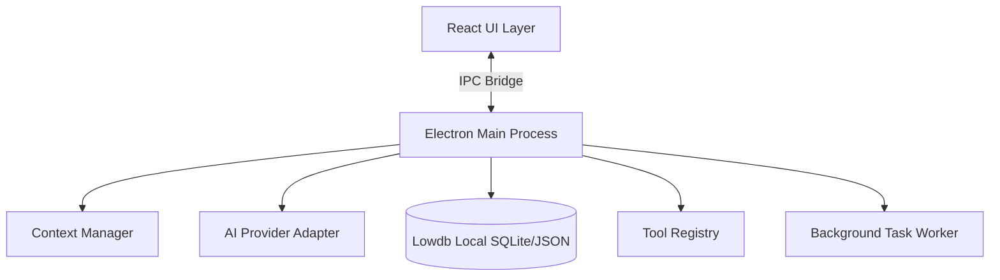

# AI Research Workspace

A robust, local-first desktop application for managing AI-assisted research projects. Built with Electron, React, and Vite, this application provides isolated workspaces, streaming AI conversations, local data persistence, and resilient background task execution.

## Setup and Run Instructions

1. **Install Dependencies:**
   \`\`\`bash
   npm install
   \`\`\`
2. **Start Development Server:**
   \`\`\`bash
   npm run dev
   \`\`\`
3. **Run Automated Tests:**
   \`\`\`bash
   npm run test
   \`\`\`

**Supported Operating Systems:** Windows, macOS, Linux (Tested primarily on Windows).
**Environment Variables & Mock Mode:** This application runs entirely in a deterministic **Mock Mode** using the `MockProvider`. No API keys, paid credentials, or environment variables are required to review the end-to-end flow.

## Architecture Overview

The application strictly separates the UI layer (React) from the system operations (Node.js/Electron Main Process) via isolated IPC channels.

## Context-Management Strategy

Before every model request, the ContextManager constructs a deliberate context package rather than blindly sending all available data to avoid token budget limits.

**Inputs Considered:** System instructions, recent chat history (ordered chronologically), and active workspace document excerpts.

**Relevance & Priority:** Document context is prioritized first, followed by system instructions. The chat history is then appended.

**Budget Allocation:** A hard token budget is enforced. If the combined inputs exceed the budget, the system aggressively truncates the oldest chat messages first to ensure the prompt fits within the context window while preserving the immediate conversational context.

**Future Scale:** At a larger scale, this system would evolve to use a local vector database (like ChromaDB or Faiss) to implement Retrieval-Augmented Generation (RAG) for semantic chunking and fetching.

## Persistence and Task-Recovery Semantics

Data is durably persisted using lowdb to a local JSON/SQLite-style file (workspace_db.json), ensuring workspace isolation.

**Task Recovery Semantics:**
Background jobs (Summarization/Extraction) and AI generations are tracked as stateful entities (Queued, Running, Completed, Failed). If the application is forcefully closed or crashes during an active generation, the task remains in the Running or Queued state in the database. On the next startup, the recoverInterruptedTasks lifecycle hook detects these orphaned tasks, marks them as Failed, and injects a transparent System Alert into the user's chat history notifying them of the interruption.

Security and Privacy Considerations
Workspace Isolation: Enforced strictly via workspaceId foreign keys at the database query level.

**Tool Validation:** The ToolRegistry isolates executable logic. The calculator tool actively sanitizes inputs and uses a scoped new Function() execution context, strictly preventing arbitrary RCE (Remote Code Execution) or script injection from hallucinated AI responses.

**Data Privacy:** All data remains on the local file system.

Trade-offs and Limitations
Mock AI Provider: To ensure a frictionless review process without API key management, the app utilizes a mock streaming provider.

**Document Parsing:** Currently restricted to .txt and .md formats to avoid heavy binary dependencies (like pdf-parse), favoring architectural clarity over file-format breadth.

**Database Choice:** lowdb was chosen for speed of development and ease of local file inspection; in production, this would be migrated to SQLite for better concurrent read/write locks.

## Use of AI Disclosure

In accordance with the assignment guidelines, I utilized an AI coding assistant (Gemini) during the development of this project.

* **What the AI helped with:** Generating boilerplate React/Electron configurations, writing regex for tool argument sanitization, assisting with the CSS/Tailwind layout, and troubleshooting Vite/Electron cache errors (`EACCES 0x5`).
* **What I independently reviewed/changed:** I architected the overall system design, decided on the `lowdb` persistence strategy, designed the `ContextManager` token-budgeting logic, implemented the IPC bridge boundaries, and wrote the Vitest test assertions to verify system security. I fully understand and can trace all generated code.

Approximate Time Spent: ~20 hours.
